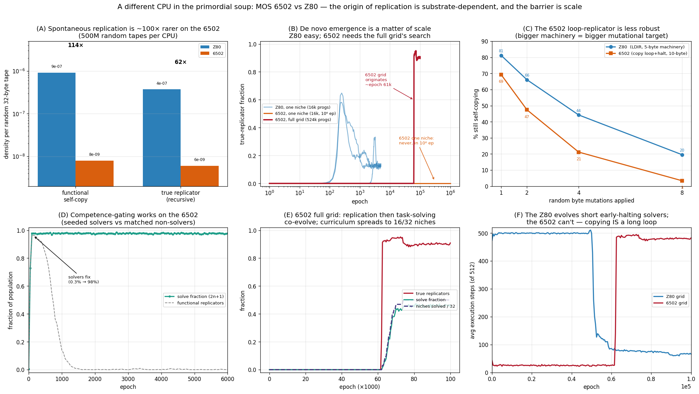

# A different CPU in the primordial soup: the MOS 6502

*Companion experiment to the Z80 replication in [`README.md`](README.md).*

Cicala et al. ([arXiv:2607.09211](https://arxiv.org/abs/2607.09211)) show that
self-replication emerges spontaneously from random **Z80** programs, and that
problem-solving co-evolves alongside it. A natural question is whether this
emergence is a general property of such digital soups or an artifact of the
particular instruction set. To address it, we rerun the identical model on the
**MOS 6502** — the other CPU core in floooh/chips — and compare the two
substrates under the same parameters.

We find that the *origin* of replication is strongly substrate-dependent, and
that the dependence is one of **scale** rather than of possibility. The Z80 owes
its result to two copy primitives that are cheap to assemble by chance: the
single-instruction block move `LDIR`, and one-byte stack pushes. The 6502 has
neither — it has no block move, and its stack route yields dead *reversed* copies
unless the source is read backwards — so a 6502 replicator must be a coordinated
copy loop together with an explicit halt. In consequence, a replicator is roughly
two orders of magnitude rarer to assemble from noise and markedly more fragile
under mutation: a single niche never originates one within the paper's 10⁶-epoch
budget, whereas the Z80 does so within a few hundred epochs. On the full 32-niche
grid, however, the larger search suffices — replication ignites de novo around
epoch 61,000, sweeps the population, and task-solving then co-evolves across the
niches, exactly as on the Z80.



## Model

We port the paper's protocol (Methods 4.1) to the 6502 in `src/sandbox6502.h`,
using the chips `m6502.h` core as reference. Two 32-byte programs are
concatenated into a 64-byte tape (every address taken modulo 64); execution
starts at `PC=0` and runs for at most 512 instructions. The register mapping
mirrors the Z80's, so that a do-nothing program cannot win the identity task for
free:

| | Z80 | 6502 |
|---|---|---|
| input | `D` = x | `X` = x |
| output | `E` | `A` (accumulator) |
| halt | `HALT` | any `JAM` opcode |

We verify the sandbox against hand-written programs (`build/test_genotype6502`):
an indexed-store copy loop and a read-backward stack push each yield an exact
32/32 self-copy, a naive *forward* stack push yields a 32/32 reversed (dead) copy,
and solvers for `n`, `2n+1` and `n²` are correct on all inputs. Two features of
the substrate are worth noting. First, copying requires a loop (~10 bytes, ~130
executed instructions) rather than the Z80's ~5-byte `LDIR`. Second, the zero
byte is `BRK` on the 6502 (destructive) rather than `NOP` (inert), so a replicator
must carry an explicit halt to protect its fresh copy.

## Findings

**1. Spontaneous replication is ~100× rarer.** Over 500M random tapes per CPU
(`build/density`), functional self-copiers occur at 9.1×10⁻⁷ on the Z80 against
8.0×10⁻⁹ on the 6502, and true (recursively reproducing) replicators at 3.7×10⁻⁷
against 6.0×10⁻⁹ — gaps of 114× and 62×. This is the mechanistic root of
everything below.

**2. De novo emergence is a matter of scale.** From random bytes, a single Z80
niche crosses into replication by epoch 200–3000; two 6502 seeds run for the full
10⁶-epoch budget (and a third at twice the mutation rate) never leave the noise
floor. The full 32-niche grid (2¹⁹ programs, tasks, cross-niche pollination) does
ignite, however: the true-replicator fraction jumps from 0 to 0.91 around epoch
61,000. The grid explores roughly 30× more variants per epoch than a niche, which
is about what the density gap of finding 1 demands.

**3. The loop-replicator is less mutationally robust.** Following the paper's
Fig. 2F, we mutate a canonical replicator *k* times and test whether it still
copies (`build/robust`). The 6502 survives less often at every *k*, and by *k*=8
only 3.4% remain functional against the Z80's 19.6% — the price of a larger
machinery (loop plus halt).

**4. Selection and co-evolution operate normally once replication exists.** Seeded
replicators sweep from 0.17% to 84% of a niche in 300 epochs, and under
competence-gating, seeded solver+replicators fix at 98% within ~100 epochs,
outcompeting matched non-solvers. The barrier is thus specific to origination, not
to the selective machinery.

**5. The evolved architecture is an indexed-store loop that cannot early-halt.**
At ignition the store-loop signature rises to 0.96 while the stack route stays at
noise, so the population converges on
`LDX #$1F; LDA $00,X; STA $20,X; DEX; BPL; JAM`. Because copying passes through the
accumulator, a solver parks its result in `Y` and restores it afterwards. Notably,
this reverses the paper's metabolic-efficiency result (their Fig. 3): where the
Z80 shortens to ~66 steps as early-halting solvers evolve, the 6502 stays at ~485,
since a replicator *is* a long copy loop and cannot be made short.

**6. After ignition, an emergent curriculum spreads.** Task-solving climbs from 0,
and the number of niches solving their polynomial rises to 16/32 (all the linear
tasks) between epochs 62,500 and 74,000, carried between niches by cross-niche
pollination; about 45% of the grid ends up solving. The curriculum is shallower
than the Z80's 27/32, but the comparison is not like-for-like: the 6502 emerged at
epoch 61k rather than 500 and had only ~39k post-emergence epochs before we stopped
at the compute budget, and was still climbing.

## Discussion

The paper shows that task demands reshape *how* a program replicates
(Load-Push → LDIR). Our experiment adds a level below this: the instruction set
fixes the *difficulty of the origin itself*. With a compact copy primitive,
replication is almost free to discover; without one it is rare enough that whether
it is observed at all depends on the scale of the search available. Origin claims
in these digital soups are therefore not substrate facts but substrate-and-scale
facts — a reading in which reported emergence times should be interpreted together
with both the instruction set and the population size. This sharpens the paper's
thesis rather than contradicting it.

## Reproduce

```bash
LIBOMP=/opt/homebrew/opt/libomp   # macOS; on Linux use plain -fopenmp
OMP="-Xpreprocessor -fopenmp -I$LIBOMP/include -L$LIBOMP/lib -lomp"  # -DNDEBUG: no-op the emulator's unreachable asserts
clang -O3 -march=native -DNDEBUG $OMP -o build/soup6502 src/soup6502.c
clang -O3 -march=native -DNDEBUG $OMP -o build/density  src/density.c
clang -O3 -march=native -DNDEBUG $OMP -o build/robust   src/robust.c
clang -O3 -march=native -DNDEBUG      -o build/analyze6502 src/analyze6502.c
clang -O2 -o build/test_genotype6502 src/test_genotype6502.c

./build/test_genotype6502                      # sandbox verification
./build/density 500000000 12345                # finding 1: replicator density (~3 min)
./build/robust  300000                         # finding 3: mutational robustness

# finding 2: de novo emergence — never on one niche, but yes on the full grid
./build/soup6502 --niches 1  --w 128 --h 128 --epochs 1000000 --notasks --seed 1 \
    --log 2000 --out results/denovo6502_notasks_s1.csv
./build/soup6502 --niches 32 --w 128 --h 128 --epochs 140000  --C 0.3 --pi 0.05 --seed 1 \
    --log 500  --out results/grid6502_2h.csv   # ~2 h; ignites ~epoch 61k

# findings 4-5: selection and competence-gating (fast), then read off the evolved genotype
./build/soup6502 --niches 1 --w 128 --h 128 --epochs 3000 --notasks --plant 30 \
    --log 300 --seed 1 --out results/plant6502.csv
./build/soup6502 --niches 1 --w 128 --h 128 --epochs 6000 --task 10 --C 0.3 \
    --plant_solver 50 --plant_dud 50 --log 50 --seed 5 --dump results/compete6502.bin \
    --out results/compete6502.csv
./build/analyze6502 results/compete6502.bin 10

python3 plot.py 6502 results/fig_6502.png
```

The only new flag beyond the Z80 soup is `--mut D` (mutation rate 1/D, default 64);
all others match `build/soup`.
