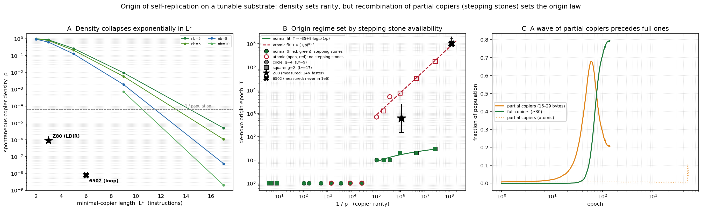

# Two regimes for the origin of self-replication: a tunable synthetic substrate

*Second companion experiment, following the Z80 replication ([`README.md`](README.md))
and the MOS 6502 comparison ([`README_6502.md`](README_6502.md)).*

The 6502 experiment established that the *origin* of self-replication is
substrate-dependent: lacking the Z80's one-instruction block move, the 6502 forms
a replicator about two orders of magnitude more rarely in random code, and never
originates one on a single niche within the paper's 10⁶-epoch budget. That
conclusion, however, rests on two data points. Here we replace the two fixed CPUs
by a synthetic instruction set with two continuous dials, which lets us both draw
the curve those points sit on and, more importantly, isolate *what* sets the
origin barrier.

Our main finding is that two quantities usually conflated are governed by different
mechanisms. The density of replicators in random code collapses exponentially with
copier length, as expected. The time for one to *originate* in an evolving
population does not follow density: it grows only logarithmically with rarity,
because partial copiers recombine into complete ones. When we remove that
recombination path, origin reverts to a density-limited law and the 6502's
behaviour is recovered. The barrier is therefore governed by whether the copy
primitive admits incremental assembly, and not by rarity on its own.



## The model

A program is 32 bytes; two are concatenated into a 64-byte tape, and the first is
executed over at most its own length. Instructions are one byte, with opcode
`byte % nb`: class 1 is `COPY` (move `g` bytes from a source head to a destination
head, advancing both), class 2 is `SETD` (aim the heads at the program start and
the partner half), and the rest are `NOP`. A program is counted as a self-copier
when it reproduces at least 30 of its 32 bytes onto a non-zero partner, exactly as
in the 6502 density measurement.

This gives two independent dials. Since `COPY` moves `g` bytes, the minimal
self-copier is `SETD ; COPY×(32/g)`, of length `L* = 1 + 32/g` instructions;
varying `g` varies `L*`, the analog of the Z80's compact `LDIR` versus the 6502's
long loop. Since `p(COPY) = p(SETD) = 1/nb`, varying `nb` lowers the copier density
at fixed `L*`. We study two variants of the soup: the **normal** one, in which a
partial copy overwrites part of its partner and so propagates its partial
machinery, and an **atomic** one, in which replication propagates only when
complete. The atomic variant is our control: it models a loop replicator, whose
half-built forms copy nothing.

## Findings

**Density is exponential in copier length.** This is very straightforward, almost obvious. Over 10⁹ random tapes per
configuration, the self-copier density falls by a roughly constant factor per
extra instruction (≈2.6–3.9×, rising with `nb`), so that for `nb = 8` it drops from
0.12 at `L* = 5` to 4×10⁻⁸ at `L* = 17`. The real Z80 and 6502 sit on the same
trend, separated by ≈4.85× per instruction. Rarity is thus, to a first
approximation, exponential in how many instructions a copier requires.

**Origin time does not track density; it tracks length.** Running the soup from
random bytes, the epoch at which replication first appears grows only
*logarithmically* with rarity, from about 10 to 70 epochs while density falls four
and a half orders of magnitude. At such densities a blind search could not assemble
a copier so quickly. The mechanism is recombination of *stepping stones*, that is,
partially functional intermediates that are themselves viable and lie on a path to
the target, so that a complex object is reached through a chain of small selectable
steps rather than in a single improbable jump. Here the stepping stones are the
*partial copiers*: a program that carries `SETD` and only some of the required
`COPY`s reproduces just part of itself, but it copies its own prefix over its
partner, so the interaction operator can compose a fuller copier from two partial
ones, building a complete copier one `COPY` at a time. We confirm this directly. The mean copy
length climbs smoothly rather than jumping; a wave of partial copiers precedes the
full ones; and, decisively, with mutation switched off entirely, the normal soup
still originates by recombination whereas the atomic soup never does.

**Removing the stepping stones recovers the density-limited law.** In the atomic
variant, where partial copies propagate nothing, origin becomes a blind parallel
search: `T ∝ (1/ρ)^{0.97}`, a near-exact inverse-density law. Consistently with
that reading, atomic origin *falls* with population size (exponent ≈ −1.2) and
*rises* as the mutation supply shrinks (≈ +1.4), whereas normal origin is
independent of both. The two mechanisms are therefore cleanly separated: stepping
stones give a fast, population- and mutation-insensitive origin, while their
absence gives a slow one set by `1/(N_pop · mut · ρ)`.

**This explains the Z80/6502 split.** The two CPUs lie on the two different laws.
The Z80's block-move and load-push copiers have partial forms; at its density the
density-limited law would demand about 8×10³ epochs, yet it originates in 150–2500,
roughly 14× faster, which is the gap that stepping stones produce. The 6502's loop
has no partial form, so it lies on the density-limited line: extrapolating the
atomic law to its density predicts an origin time of order 10⁶ epochs, matching the
observation that it never originates on a single niche, while the population scaling
predicts that the 32×-larger grid should cut this to order 10⁴, against the observed
~61k. This refines the earlier "origin is substrate-and-scale" statement into a
sharper one: the origin *regime* is set by whether the copy primitive admits
incremental, recombinable assembly.

## The empirical laws

Three quantitative regularities emerge from the experiments; we collect them here.

**Density of spontaneous copiers.** Rarity is exponential in the length of the
minimal self-copier:

$$\rho(L^*) \;\propto\; b^{-L^*}, \qquad L^* \;=\; 1 + \ell/g .$$

**Origin with stepping stones (the `normal` soup).** Once partial copiers
recombine, the first copier appears in a time that grows only with copier length,
that is, logarithmically in rarity, and independently of population and mutation:

$$T_{\mathrm{normal}} \;\approx\; A + B\,\log_{10}\!\big(1/\rho\big) \;\propto\; L^* .$$

**Origin without stepping stones (the `atomic` control).** Removing the
recombination path turns origin into a blind parallel search whose time is set
jointly by rarity, population size, and mutation supply:

$$T_{\mathrm{atomic}} \;\propto\; \frac{1}{N_{\mathrm{pop}}\;\mu\;\rho} .$$

where

- $\rho$ is the spontaneous self-copier density, the fraction of random programs
  that already reproduce $\ge 30/32$ of their bytes onto a partner;
- $L^*$ is the minimal-copier length in instructions, $1 + \ell/g$, with $\ell = 32$
  the program length in bytes and $g$ the copy granularity (bytes moved per `COPY`);
- $b$ is the factor by which density drops per extra instruction the copier
  requires ($b \approx 2.6$–$3.9$, rising with $nb$; $\approx 4.85$ for the real
  Z80 $\to$ 6502 step). It grows with the opcode-bucket count $nb$ because
  $p(\texttt{COPY}) = p(\texttt{SETD}) = 1/nb$;
- $T$ is the de-novo origin time, the epoch at which the first self-copier appears;
- $A, B$ are the fitted constants of the logarithmic law ($A \approx -35$,
  $B \approx 9$ epochs per decade of $1/\rho$);
- $N_{\mathrm{pop}}$ is the population size and $\mu$ the per-program mutation rate;
  the measured exponents on $1/\rho$, $N_{\mathrm{pop}}$, and $\mu$ are all close to
  one ($0.97$, $1.2$, and $1.4$ respectively).

A copier common enough to sit in the initial random population,
$\rho \gtrsim 1/N_{\mathrm{pop}}$, needs no assembly; the origin laws above describe
the assembled regime $\rho \lesssim 1/N_{\mathrm{pop}}$.

## Discussion

The original paper shows that task demands reshape *how* a program replicates; the
6502 experiment showed that the instruction set fixes *how rare* a replicator is.
This experiment adds that rarity is not decisive on its own: in a mutating
population, what determines whether a rare replicator originates is whether the
path to it is paved with functional partial copiers that recombination can
compose. This is the same "stepping stones beat direct optimization" logic the
paper invokes for task curricula, operating one level below, on the origin of
replication itself; and the engine turns out to be recombination, the genetic
exchange the paper flags as unstudied.

One limitation should be stated plainly. The synthetic `COPY` reads from the
program's own start, so a partial copier copies its own machinery first, an
idealized and unusually strong stepping stone that likely overstates the magnitude
of the speedup (the Z80's ~14× is more modest). The qualitative dichotomy, however,
matches both real CPUs. The natural next step is a synthetic loop copier with a
fragile branch offset and no partial form, to place a genuine synthetic point on
the density-limited line without the atomic proxy.

## Reproduce

```bash
LIBOMP=/opt/homebrew/opt/libomp   # macOS; on Linux use plain -fopenmp
OMP="-Xpreprocessor -fopenmp -I$LIBOMP/include -L$LIBOMP/lib -lomp"
clang -O3 -march=native $OMP -o build/density_min src/density_min.c
clang -O3 -march=native $OMP -o build/soup_min    src/soup_min.c

# density vs L* (both dials), 1e9 tapes/config
./build/density_min 1000000000 12345 > results/density_min.csv
./build/density_min 1000000000 12345 "10,12,14,16" "4,2" > results/density_min_extra.csv

# origin WITH stepping stones (fast) and WITHOUT (--atomic, density-limited)
./build/soup_min --niches 1 --w 128 --h 128 --g 2 --nb 6 --seed 1 --log 10 \
   --maxafter 800 --out results/origin_nb6_g2_s1.csv
./build/soup_min --niches 1 --w 128 --h 128 --g 2 --nb 6 --seed 1 --log 100 \
   --maxafter 2000 --atomic --out results/atomic_nb6_g2_s1.csv

# mechanism: recombination alone (mutation off) originates normally but never atomically
./build/soup_min --niches 1 --w 128 --h 128 --g 2 --nb 6 --seed 1 --mut 1000000000 \
   --log 50 --maxafter 600 --out results/nomut_normal_s1.csv

python3 plot_min.py results/fig_phase.png
```

New flags beyond the 6502 soup are `--g`, `--nb` (the two dials), `--maxafter K`
(stop `K` epochs after origin), and `--atomic` (propagate only complete copies);
`soup_min` additionally logs `partial_frac`, `mean_copybytes`, and `max_copybytes`.
The full sweeps behind each panel are grid loops over these commands; under `fish`,
wrap them in `bash -c '...'`. See the git history for the exact seed and
configuration lists.
